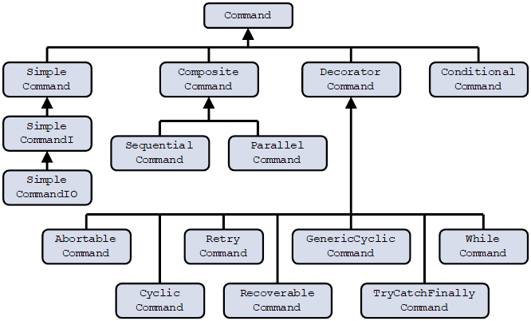
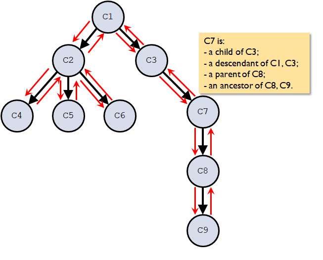

[[Previous section]](Section2.md) / [[Next section]](Section4.md)             

[[Table of contents]](TableOfContent.md)

# 3. The structure of the Extensible Commands library.

## 3.1. Command hierarchy.

All command classes belong to a unified hierarchical structure derived from an abstract base class Command which implements the ICommand interface (Figure 1). 

This hierarchy is designed to provide a wide range of possibilities to construct very complex sequences of operations by building progressively more complex commands by combining all of the above types. Short summaries of each command class are provided in Table 1.

In this document, specific commands are referred to either by a command class name (i.e. WhileCommand) or by a common description (i.e. While command). 

Figure 1. Command class hierarchy.

|Command class|Derived from|Description|
|---------------|---------------|------------|
|Command|(Implements ICommand interface)|Top-level class in hierarchy (abstract).|
|SimpleCommand|Command|Implements an atomic operation (equivalent to a method).|
|SimpleCommandI<TInput>|SimpleCommand|Implements an atomic operation with an input parameter.|
|SimpleCommandIO<TInput, TOutput>|SimpleCommandIO<TInput>|Implements an atomic operation with input and output parameters.|
|ConditionalCommand|Command|Implements logical branching (equivalent to if/else statement).|
|DecoratorCommand|Command|Implements a container for another command with the possibility to add new functionality (abstract).|
|CompositeCommand|Command|Implements a container for multiple commands that would be executed as a set (abstract).|
|SequentialCommand|CompositeCommand|Implements a sequence of commands executed one after another.|
|ParallelCommand|CompositeCommand|Implements a sequence of commands executed in parallel.|
|AbortableCommand|DecoratorCommand|Implements an atomic operation that can be aborted during execution.|
|CyclicCommand|DecoratorCommand|Implements a cycle with a fixed number of iterations (equivalent to a for loop).|
|GenericCyclicCommand|DecoratorCommand|Implements an iteration through a collection (equivalent to a foreach loop).|
|RecoverableCommand|DecoratorCommand|Implements a recoverable operation.|
|RetryCommand|DecoratorCommand|Implements an operation with a retry.|
|TryCatchFinallyCommand|DecoratorCommand|Implements an operation with additional operations on failure and success (equivalent to a try/catch/finally block).|
|WhileCommand|DecoratorCommand|Implements a cycle iterating while a condition is true (equivalent to a while loop).|
 
Table 1. Command classes.

## 3.2. Command tree.

As was noted in [Section 2](Section2.md), the Extensible Commands approach combines Command, Decorator, and Composite patterns. This means that while command classes form an inheritance hierarchy, command objects form a containment hierarchy. In other words, command objects can contain other command objects (of any command type in the command class hierarchy). Thus, it is possible to construct complex commands containing multiple layers of other commands with arbitrary depth. This is the key principle of the Extensible Commands library design.
 
It is not difficult to recognize that such a construct can be effectively visualized by a data structure well-known as a non-binary (or multi-furcating) tree (see Figure 2). In this representation, each command is a tree node, and containment relationships between commands are the links between the nodes. Adopting terms commonly used for the description of tree data structures, the higher of the two connected nodes will be called a parent, or a parent command, and the lower of the two - a child, or a child command. Any node belonging to a particular sub-tree would be a descendant, or a descendant command, of the root of that sub-tree. A node without children would be referred to as a leaf, or a leaf command. A complex command can thus be represented by a "command tree".
 
Hereafter in this document, the terms "parent command", "child command", "descendant command" and "leaf command" will be used to describe their relative place in the "command tree". To avoid confusion with inheritance relationships, the terms "base" and "derived" will be used exclusively to describe command class relationships, and the terms "parent" and "child" exclusively to describe command object relationships. The terms "child command" and "sub-command" will be used interchangeably. 

 
Figure 2. An example of a command tree showing a traversal (execution) path.
 
Execution of a complex command would then correspond to depth-first traversal of the command tree, which involves moving down the left branch of any sub-tree until a leaf node is reached, then retracing the path and visiting the right branch. It should be noted that this is not a perfect analogy, since, for some types of commands, execution is different from sequential visiting of all child nodes once. For example, as will be seen later, for Conditional command, only one child command (out of the two) is executed. There are other deviations as well. However, it does not take away from the usefulness of the tree representation.
 
It is worth pointing out that commands with children (i.e. nodes at the root of any sub-tree) serve as "flow-control" commands. Commands without children, or leaf commands (i.e. nodes at the end of branches), perform actual units of work. Leaf commands must be Simple commands, as this is the only Command class that does not have child commands. Thus, creating commands that perform complex operations requires the construction of command trees. Practical examples of this process are given in [Section 5](Section5.md).
 
## 3.3. ICommand interface.

The basic functionality of command classes is distilled in the ICommand interface. [[C# code]](../CSharp/ExtensibleCommands/ExtensibleCommands/ICommand.cs) [[Java code]](../Java/ExtensibleCommands/src/main/java/org/extensiblecommands/Command.java)
 
|Member|Type / Return type|Meaning|
|---------------|---------------|------------|
|Name|String|Descriptive name identifying this instance of a command object.|
|CurrentState|State (enum)|A state of the command.|
|StateChanged|IObservable<State>|An observable signaling when the command's state changes.|
|ProgressUpdated|IObservable<ProgressUpdate>|An observable signaling when a progress update is ready.|
|Exception|ExtensibleCommandsException|Holds exception information if a failure has occurred. If not, it is set to NULL.|
|Children|IEnumerable<ICommand>|List of all child commands (the first level below in the command tree).|
|Descendants|IEnumerable<ICommand>|List of all descendant commands (all levels below in the command tree).|
|ElapsedTime|TimeSpan	Time of command execution.|Can be called during or after execution.|
|ElapsedTimeMsec|Int|Time of execution (in msec). Set when the command completes. Not valid during the execution.|
|FractionCompleted|Double|Fraction of the command that is completed (calculated as a fraction of “leafs” that have been completed), between 0 and 1.|
|PercentCompleted|Int|Percentage of the command that is completed (calculated as a percentage of “leafs” that have been completed), between 0 and 100.|
|Run()||Runs the command.|
|Pause()||Pauses the command.|
|Resume()||Resumes the command if it has been paused previously.|
|Abort()||Aborts the command.|
|ResetFinished()||Resets Finished event to ensure that WaitUntilFinished() method works correctly.|
|WaitUntilFinished(int timeoutMsec)||Waits until the command is finished (with any result) or the timeout expires.|
 
Table 2. ICommand interface.

## 3.4. Command lifecycle events and state diagram.
 
During its lifetime, every command object can be in one of the several states, as shown in Table 3.
 
|State|Meaning|
|---------------|---------------|
|Idle|Command has been created, but not executed.|
|Executing|Command is in the process of being executed.|
|Failed|Command has been completed unsuccessfully, i.e. with an error. ExtensibleCommandsException has been thrown within the body of Execute() method.|
|Completed|Command has been completed successfully.|
|Aborted|Command has been aborted during its execution. It may not be resumed.|
 
Table 3. Command states.
 
If there are no errors, when a command is being executed it will pass through a sequence Idle -> Executing -> Completed (Failed, Aborted). It will remain in its final state until it is executed again, in which case the state will be reset to Idle just before execution. Every command may be executed an unlimited number of times during its lifetime. 
 
If a command is not currently executing, it may be in any of the four states: Idle, Failed, Completed, or Aborted. The specific state depends on the history of this command and is not guaranteed to be one or the other at any given time.

 
Figure 3. Command state diagram.

## 3.5. Error handling.
 
One of the key advantages of Extensible Commands is the semi-automatic handling of exceptions. Every command object must define Execute() method that will be executed as part of running this command. For Composite commands, Execute() method is simply an iteration through Execute() methods of child commands. For Simple commands Execute() method needs to be defined programmatically.
 
Internally, Execute() method is launched from the Run() method that gets called either directly from the code, or from a parent command. Extensible Commands defines its own exception type, ExtensibleCommandsException, that is caught within every Run() method. Exceptions of other types (i.e. not derived from ExtensibleCommandsException) are not caught by the framework and will propagate outside of it. Once an ExtensibleCommandsException is caught, it is stored in the Exception property of the Command class, the command state is set to Failed, and the EventFailure event is generated. 
 
If the “offending” command is top-level (i.e. it is not invoked from another command), this is the end of the process. If it is a part of a Composite or a Decorator command, the error will bubble up to the parent command and further up until it reaches the top-level command while setting all of these parent commands to Failed state and generating EventFailure for each of these commands.  From there, any error processing module may easily subscribe to the Failed event on any command of interest and handle the error in accordance with the supplied error information, and with the requirements of the application.
 

 
Figure 4. Error handling.
 
## 3.6. Pause, Resume, and Abort.
 
In general, this functionality is difficult to add to the existing code, if it has not been planned from the beginning. To accept and gracefully react to an abort command at any time during the operation requires substantial efforts in design and development, as well as presents code maintenance issues. By virtue of its approach of considering any operation as a collection of individual building blocks with similar behavior, this functionality is supported in full “out of the box”. For operations implemented using Extensible Commands, there is no need to write any code to pause/resume and abort, which may represent a very significant value in terms of development efforts. 
 
The ICommand interface defines (and Command class implements) methods Pause(), Resume(), and Abort() that are available to all derived classes. The implementation uses the composition property of the command classes and recursively iterates through the command’s sub-commands, invoking a required operation on each one. 
 
Calling Pause() or Abort() on a command object does not guarantee an immediate result. These methods will set a flag internally, that will be checked at the next junction point between command objects in the execution path, and the command will be paused or aborted at that time. Depending on how a given process was broken down into atomic commands (i.e. SimpleCommand objects), the “reaction” time may vary quite a lot. If a very quick reaction is needed, the inclusion of AbortableCommand may be necessary which provides the capability of customizing Abort behavior and guaranteeing termination as soon as system resources allow at the moment of the Stop or Abort trigger.
 
If a command has been previously paused, calling Resume() on it will immediately cause the advancement of the execution to the next command object in the sequence.
 
|Method/Property|Function|
|---------------|---------------|
|Pause()|Indefinitely pauses the command at the closest junction point.|
|Resume()|Resumes the command if it has been previously paused. If it has not been paused, it has no effect.|
|Abort()|Aborts the command at the closest junction point. Will also abort the command that is waiting to resume.|
 
Table 4. Pause, Resume, and Abort functionality.

Calling any of these methods on a particular command object will only affect this command object.

 
Figure 5. Pause/Resume.
 

 
Figure 6. Abort.
 
## 3.7. Thread safety.

The execution of commands is thread-safe. The Run() method in the Command class is protected by a lock, so it can be called from multiple threads.

[[Previous section]](Section2.md) / [[Next section]](Section4.md)             

[[Table of contents]](TableOfContent.md)
