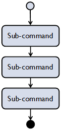
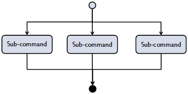
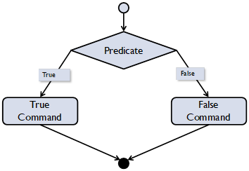
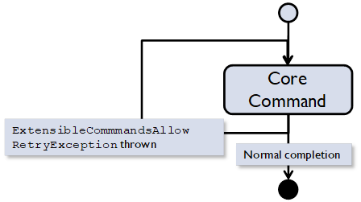
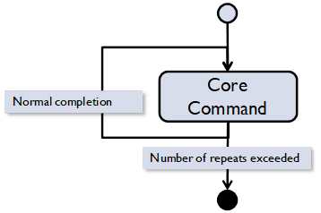
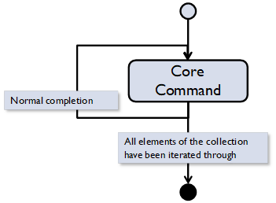
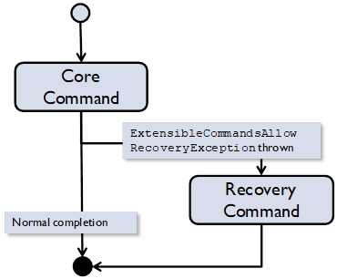
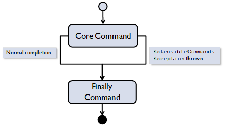
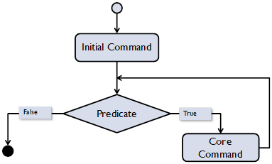
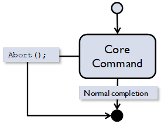

[[Previous section]](Section3.md) / [[Next section]](Section5.md)             

[[Table of contents]](TableOfContent.md)

# 4.	Command classes.

This section provides an in-depth look at each of the command class in Extensible Commands.

## 4.1.	SimpleCommand.

[[C# code]](../CSharp/ExtensibleCommands/ExtensibleCommands/SimpleCommand.cs) [[Java code]](../Java/ExtensibleCommands/src/main/java/org/extensiblecommands/SimpleCommand.java)
[[C# unit tests]](../CSharp/ExtensibleCommands/ExtensibleCommandsUnitTests/SimpleCommandTest.cs) [[Java unit tests]](../Java/ExtensibleCommands/src/test/java/org/extensiblecommands/SimpleCommandTest.java)

The SimpleCommand class implements an atomic operation. It encapsulates a method (without parameters and return value) that is executed when the command is run. For example, to instantiate a SimpleCommand object:

```var simpleCommand = new SimpleCommand(() => Console.WriteLine("Simple 	Command test"), 	"Simple Command");```

Obviously, it is also possible to define a method first and then pass it signature to the SimpleCommand constructor (instead of a lambda expression).

### 4.1.1.	SimpleCommandI<TInput> and SimpleCommandIO<TInput, TOutput>.
	
SimpleCommand class has generic versions that encapsulate execution of methods with input and output. As implemented, they are limited to only a single input parameter and a single output parameter. If more input and output parameters are needed, either more generic classes need to be implemented, or data needs to be aggregated under a single container class.
	
This section describes the simplest use case for Simple command with input/output parameters. The issues related to parameter management in a complex command are discussed in [Section 5.2](Section5.md).
	
#### 4.1.1.1	SimpleCommandI<TInput>.
	
[[C# code]](../CSharp/ExtensibleCommands/ExtensibleCommands/SimpleCommand.cs) [[Java code]](../Java/ExtensibleCommands/src/main/java/org/extensiblecommands/SimpleCommand.java)
[[C# unit tests]](../CSharp/ExtensibleCommands/ExtensibleCommandsUnitTests/SimpleCommandTest.cs) [[Java unit tests]](../Java/ExtensibleCommands/src/test/java/org/extensiblecommands/SimpleCommandTest.java)
	
To implement an operation with an input parameter, one needs to create a SimpleCommandI<TInput> object specifying a concrete input parameter type, and provide a delegate that will perform desired operation with the input data. To execute this command,  the input parameter needs to be set and the command run:
	
```
var simpleCommand = new SimpleCommandI<int>(i => Console.WriteLine("Simple Command input = {0}", i), "Simple Command with input");
simpleCommand.Input = 10;
simpleCommand.Run();
```
	
#### 4.1.1.2	SimpleCommandIO<TInput, TOutput>.
	
[[C# code]](../CSharp/ExtensibleCommands/ExtensibleCommands/SimpleCommand.cs) [[Java code]](../Java/ExtensibleCommands/src/main/java/org/extensiblecommands/SimpleCommand.java)
[[C# unit tests]](../CSharp/ExtensibleCommands/ExtensibleCommandsUnitTests/SimpleCommandTest.cs) [[Java unit tests]](../Java/ExtensibleCommands/src/test/java/org/extensiblecommands/SimpleCommandTest.java)
	
To implement an operation with an input and output parameter, one needs to create a SimpleCommandIO<TInput, TOutput> object specifying concrete input and output parameter types, and provide a delegate that performs desired operation with the input data and sets the value of the output parameter. To execute this command, one needs to set the input parameter, run the command and extract the output:
	
```
var simpleCommand = new SimpleCommandIO<int, int>(i => i*i, "Simple Command with input/output");
simpleCommand.Input = 2;
simpleCommand.Run();
Console.WriteLine("Simple Command output = {0}", simpleCommand.Output);
```
	
## 4.2.	SequentialCommand.

[[C# code]](../CSharp/ExtensibleCommands/ExtensibleCommands/SequentialCommand.cs) [[Java code]](../Java/ExtensibleCommands/src/main/java/org/extensiblecommands/SequentialCommand.java)
[[C# unit tests]](../CSharp/ExtensibleCommands/ExtensibleCommandsUnitTests/SequentialCommandTest.cs) [[Java unit tests]](../Java/ExtensibleCommands/src/test/java/org/extensiblecommands/SequentialCommandTest.java)
	
The SequentialCommand class is expected to be one of the most used Extensible Commands classes. It chains sub-commands to create a linear sequence. Provided DoSomething1() and DoSomething2() methods are defined, they are going to be executed sequentially.
	
```
var step1 = new SimpleCommand(DoSomething1, "Step 1");
var step2 = new SimpleCommand(DoSomething2, "Step 2");
var sequentialCommand = new SequentialCommand("Sequential Command");
sequentialCommand.Add(step1);
sequentialCommand.Add(step2);
```
	
Alternatively, sub-commands can be added to a Sequential command via Add() methods in the fluent interface style:
	
```var sequentialCommandA = new SequentialCommand("Sequential Command A").Add(step1).Add(step2);```
 

	
Figure 7. Sequential command flowchart.
	
## 4.3.	ParallelCommand.
	
[[C# code]](../CSharp/ExtensibleCommands/ExtensibleCommands/ParallelCommand.cs) [[Java code]](../Java/ExtensibleCommands/src/main/java/org/extensiblecommands/ParallelCommand.java)
[[C# unit tests]](../CSharp/ExtensibleCommands/ExtensibleCommandsUnitTests/ParallelCommandTest.cs) [[Java unit tests]](../Java/ExtensibleCommands/src/test/java/org/extensiblecommands/ParallelCommandTest.java)
	
The ParallelCommand class executes commands in parallel on separate threads from a thread pool. It can be instantiated in the same way as a SequentialCommand object:

```
var parallelCommand = new ParallelCommand("Parallel Command");
parallelCommand.Add(new SimpleCommand(DoSomething1, "Step 1"));
parallelCommand.Add(new SimpleCommand(DoSomething2, "Step 2"));	
```
	
As in the case of Sequential command, the object can be instantiated in fluent interface style:

```	
var parallelCommandA = new ParallelCommand("Parallel Command A")
   .Add(new SimpleCommand(DoSomething1, "Step 1"))
   .Add(new SimpleCommand(DoSomething2, "Step 2"));
```
	
	
If one of the sub-commands fails during execution, all other sub-commands will continue execution until their completion or failure, and then the failure of the Parallel command will be processed (its state will be set to Failed if at least one sub-commands failed, and to Completed otherwise).
 

	
Figure 8. Parallel command flowchart.
	
## 4.4.	ConditionalCommand.
	
[[C# code]](../CSharp/ExtensibleCommands/ExtensibleCommands/ConditionalCommand.cs) [[Java code]](../Java/ExtensibleCommands/src/main/java/org/extensiblecommands/ConditionalCommand.java)
[[C# unit tests]](../CSharp/ExtensibleCommands/ExtensibleCommandsUnitTests/ConditionalCommandTest.cs) [[Java unit tests]](../Java/ExtensibleCommands/src/test/java/org/extensiblecommands/ConditionalCommandTest.java)
	
The ConditionalCommand class represents branching depending on a Boolean condition. It is basically identical to the if/else operator. To use Conditional command, a predicate delegate and two commands need to be defined, each of which is represented by a property of the ConditionalCommand class:
- Predicate, which is evaluated first;
- TrueCommand, which is executed if the Predicate is evaluated to true; 
- FalseCommand, which is executed if the Predicate is evaluated to false.
	
To create a ConditionalCommand object (assuming Boolean variable flag was already defined):

```
var trueCommand = new SimpleCommand(() => { }, "True");
var falseCommand = new SimpleCommand(() => { }, "False");
var conditionalCommand = new ConditionalCommand(() => flag, trueCommand, falseCommand, "Conditional");
```

Note that ConditionalCommand class is derived directly from Command class, and not from DecoratorCommand class, because it does not have a Core command.
	

	
Figure 9. Conditional command flowchart.
	
## 4.5.	DecoratorCommand.
	
[[C# code]](../CSharp/ExtensibleCommands/ExtensibleCommands/DecoratorCommand.cs) [[Java code]](../Java/ExtensibleCommands/src/main/java/org/extensiblecommands/DecoratorCommand.java)
	
All decorator commands have a Core command that is always executed, and then optionally one or more commands that can be executed before or after the Core command depending on the specific conditions. This construct allows creation of control flow scenarios covering many important use cases. All decorator command objects have a property called CoreCommand. DecoratorCommand is an abstract class and cannot be instantiated.
	
## 4.6.	RetryCommand.

[[C# code]](../CSharp/ExtensibleCommands/ExtensibleCommands/RetryCommand.cs) [[Java code]](../Java/ExtensibleCommands/src/main/java/org/extensiblecommands/RetryCommand.java)
[[C# unit tests]](../CSharp/ExtensibleCommands/ExtensibleCommandsUnitTests/RetryCommandTest.cs) [[Java unit tests]](../Java/ExtensibleCommands/src/test/java/org/extensiblecommands/RetryCommandTest.java)
	
The RetryCommand class implements a repeated execution of a command in case of certain failures. The command is retried if an exception of type ExtensibleCommandsAllowRetryException is thrown within the Execute() method of the CoreCommand property. For example:

```	
var coreCommand = new SimpleCommand(() => { throw new 	ExtensibleCommandsAllowRetryException(0, "ERROR!"); });
var retryCommand = new RetryCommand(coreCommand, 3, 100, "Retry command with delay");
```

After the first failure, the Core command will be retried 3 more times, each time waiting 100 msec before a retry. After the last retry, the Retry command will fail. This happens, because the exception type within the body of the Core command allows retries. If the exception had been of type ExtensibleCommandsException, the command would have failed immediately.
 

	
Figure 10. Retry command flowchart.
	
## 4.7.	CyclicCommand.
	
[[C# code]](../CSharp/ExtensibleCommands/ExtensibleCommands/CyclicCommand.cs) [[Java code]](../Java/ExtensibleCommands/src/main/java/org/extensiblecommands/CyclicCommand.java)
[[C# unit tests]](../CSharp/ExtensibleCommands/ExtensibleCommandsUnitTests/CyclicCommandTest.cs) [[Java unit tests]](../Java/ExtensibleCommands/src/test/java/org/extensiblecommands/CyclicCommandTest.java)
	
The CyclicCommand class implements a loop:
	
```var cyclicCommand = new CyclicCommand(new SimpleCommand(DoSomething), 100, "Repeat DoSomething() 100 times");```
 

	
Figure 11. Cyclic command flowchart.

This Cyclic command will run the Core command 100 times. If any of these runs fail, the Cyclic command immediately fails.

## 4.8.	GenericCyclicCommand.
	
[[C# code]](../CSharp/ExtensibleCommands/ExtensibleCommands/GenericCyclicCommand.cs) [[Java code]](../Java/ExtensibleCommands/src/main/java/org/extensiblecommands/GenericCyclicCommand.java)
[[C# unit tests]](../CSharp/ExtensibleCommands/ExtensibleCommandsUnitTests/GenericCyclicCommandTest.cs) [[Java unit tests]](../Java/ExtensibleCommands/src/test/java/org/extensiblecommands/GenericCyclicCommandTest.java)
	
The GenericCyclicCommand class also implements a loop, but it is based on a collection of generic type T that is supplied as a parameter to this command’s constructor. During execution the collection is iterated through and the Core command is executed on every iteration.
	
```
var list = new List<int> { 10, 20, 30 };
var coreCommand = new SimpleCommand(DoSomething);
var genericCyclicCommand = new GenericCyclicCommand<int>(coreCommand, list, "Cycle through elements of the list");
```
	

	
Figure 12. Generic Cyclic command flowchart.

## 4.9.	RecoverableCommand.
	
[[C# code]](../CSharp/ExtensibleCommands/ExtensibleCommands/RecoverableCommand.cs) [[Java code]](../Java/ExtensibleCommands/src/main/java/org/extensiblecommands/RecoverableCommand.java)
[[C# unit tests]](../CSharp/ExtensibleCommands/ExtensibleCommandsUnitTests/RecoverableCommandTest.cs) [[Java unit tests]](../Java/ExtensibleCommands/src/test/java/org/extensiblecommands/RecoverableCommandTest.java)
	
The RecoverableCommand class allows execution of a recovery command if the Core command fails. For this mechanism to be triggered, the Execute() method of the CoreCommand property should throw exception of type ExtensibleCommandsAllowRecoveryException.
	
```
var coreCommand = new SimpleCommand(() => { throw new ExtensibleCommandsAllowRecoveryException(0, "ERROR!"); });
var recoveryCommand = new SimpleCommand(DoSomething);
var recoverableCommand = new RecoverableCommand(coreCommand, recoveryCommand, "Recoverable Command");
```
	
The recovery command will be executed after the Core command fails.


	
Figure 13. Recoverable command flowchart.
	
One useful construct is to enclose a Retry command inside a Recoverable command. This is a fairly common case for handling an inherently unreliable operation (for example, when a resource may not be available all the time):

```
var coreCommand = new SimpleCommand(() => { throw new ExtensibleCommandsAllowRetryException(0, "ERROR!"); });
var retryCommand = new RetryCommand(coreCommand, 3, 100, "Retry command with delay");
var recoveryCommand = new SimpleCommand(DoSomething);
var recoverableCommand = new RecoverableCommand(retryCommand, recoveryCommand, "Retry and Recovery");
```
	
This code works because ExtensibleCommandsAllowRetryException is derived from ExtensibleCommandsAllowRecoveryException.
	
## 4.10. TryCatchFinallyCommand.
	
[[C# code]](../CSharp/ExtensibleCommands/ExtensibleCommands/TryCatchFinallyCommand.cs) [[Java code]](../Java/ExtensibleCommands/src/main/java/org/extensiblecommands/TryCatchFinallyCommand.java)
[[C# unit tests]](../CSharp/ExtensibleCommands/ExtensibleCommandsUnitTests/TryCatchFinallyCommandTest.cs) [[Java unit tests]](../Java/ExtensibleCommands/src/test/java/org/extensiblecommands/TryCatchFinallyCommandTest.java)
	
The TryCatchFinallyCommand class is similar to RecoverableCommand class, but it allows execution of a command (FinallyCommand) regardless of failure or success of the Core command. Whether an ExtensibleCommandsException is generated within the Execute() method of the Core command, or not, FinallyCommand will be executed. This scenario is useful if a certain operation (such as a return to a safe state, for example) is needed regardless of the overall command outcome.
	
```
var coreCommand = new SimpleCommand(DoSomething);
var finallyCommand = new SimpleCommand(ReturnToSafeState);
var tryCatchFinallyCommand = new TryCatchFinallyCommand(coreCommand, finallyCommand, "Try-Catch-Finally");
```
 

	
Figure 14. Try-Catch-Finally command flowchart.
	
## 4.11. WhileCommand.
	
[[C# code]](../CSharp/ExtensibleCommands/ExtensibleCommands/WhileCommand.cs) [[Java code]](../Java/ExtensibleCommands/src/main/java/org/extensiblecommands/WhileCommand.java)
[[C# unit tests]](../CSharp/ExtensibleCommands/ExtensibleCommandsUnitTests/WhileCommandTest.cs) [[Java unit tests]](../Java/ExtensibleCommands/src/test/java/org/extensiblecommands/WhileCommandTest.java)
	
The WhileCommand class executes a Core command multiple times until a predicate condition is satisfied (assuming an integer variable counter is defined):
	
```
var coreCommand = new SimpleCommand(() => counter++);
var initCommand = new SimpleCommand(() => counter = 0);
var whileCommand = new WhileCommand(() => counter < 5, initCommand, coreCommand, "While Command");
```
																				
Initial command is optional. If it is not supplied (i.e. = NULL), then command will start with the next step, which is a predicate evaluation.


						      
Figure 15. While command flowchart.

## 4.12. AbortableCommand.
	
[[C# code]](../CSharp/ExtensibleCommands/ExtensibleCommands/AbortableCommand.cs) [[Java code]](../Java/ExtensibleCommands/src/main/java/org/extensiblecommands/AbortableCommand.java)
[[C# unit tests]](../CSharp/ExtensibleCommands/ExtensibleCommandsUnitTests/AbortableCommandTest.cs) [[Java unit tests]](../Java/ExtensibleCommands/src/test/java/org/extensiblecommands/AbortableCommandTest.java)
						
The AbortableCommand class is important for implementing atomic operations that may need to be aborted before they are completed. For example, an operation on a hardware device may take a long time to complete and may need to be aborted quickly due to safety reasons. The AbortableCommand class allows convenient packaging of such operations.
							
First, there needs to be defined Abort() method that actually terminates whatever operation is implemented in the Core command. Then, an Abortable command can be defined:
														
```
var coreCommand = new SimpleCommand(DoSomething);
var abortableCommand = new AbortableCommand(new ExtensibleCommandsException(0, "Timeout"), 
    coreCommand, 5000, Abort, "Abortable command test");
```
						
If during the execution of the Core command, Abortable command is aborted (by externally or internally calling Abort()method of the AbortableCommand object) it will transition to Aborted state. Its parent command will handle this situation gracefully, and will also transition to Aborted state. Similarly, if a parent command of any level is aborted, Abortable command will be aborted by invoking its Abort()method.
							
If an Abortable command is aborted, it cannot be resumed and will need to be run again. This is handled by Stop/Resume/Abort mechanism automatically.
						      
					
 
Figure 16. Abortable command flowchart.

[[Previous section]](Section3.md) / [[Next section]](Section5.md)             

[[Table of contents]](TableOfContent.md)
