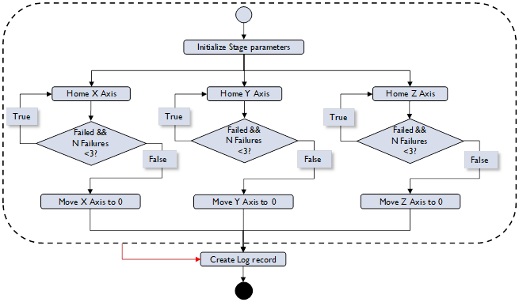
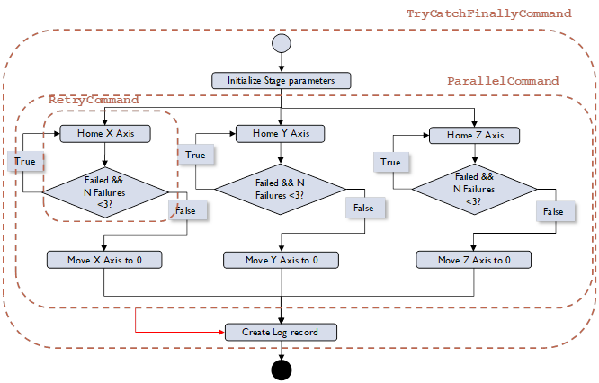
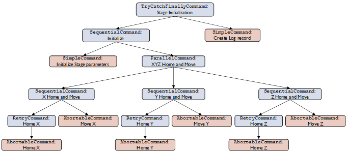
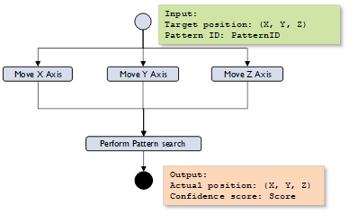
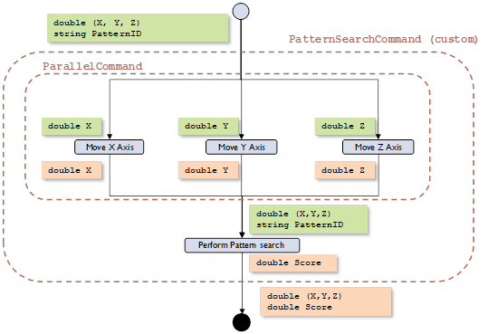
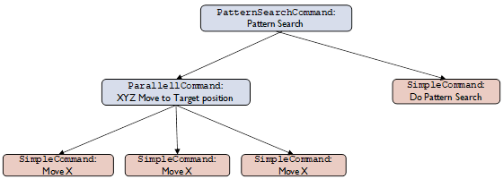
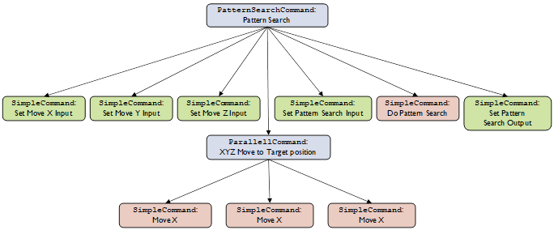

[[Previous section]](Section4.md) / [[Next section]](Section6.md)             

[[Table of contents]](TableOfContent.md)

# 5.	Putting it all together: applying Extensible Commands to practical cases.

This section shows how to apply Extensible Commands to actual software development problems using two examples. The first example focuses on how to decompose an operational sequence into a command tree for the case of initialization of a mechanical stage. The second example focuses on handling input and output parameters for the case of pattern search sequence.

## 5.1.	Stage Initialization sequence.

[[C# unit tests]](../CSharp/ExtensibleCommands/ExtensibleCommandsUnitTests/GenericExtensibleCommandsTest.cs) [[Java unit tests]](../Java/extensiblecommands/src/test/java/org/extensiblecommands/GenericExtensibleCommandsTest.java)

As the first example let’s consider how to implement an initialization sequence for a mechanical stage with 3 degrees of freedom using Extensible Commands. The stage has 3 axes (X, Y and Z) that need to be homed and then positioned at a pre-defined initial location. Homing is not 100% reliable, so it needs to be retried 2 times if it fails initially. Axes can move independently. At the end of the sequence, a log record is created. A flowchart describing the sequence is shown in Figure 17.
To represent this flowchart as a command, we need to extract the steps where the actual work is done and the steps responsible for flow control logic.



Figure 17. Stage Initialization sequence flowchart.

The steps where the work is done are:
1) Initialize stage parameters.
2) Home X/Y/Z axes.
3) Move X/Y/Z axes to Zero position.
4) Create log record.



Figure 18. Stage Initialization sequence flowchart.

The flow control logic steps are:
1) Parallel execution of Home/Move.
2) Home retry.
3) Create log record regardless of success or failure of the entire operation.

The partial result of this decomposition is shown in Figure 18.

The next step is to create a command tree that represents this sequence. As was pointed in [Section 3.2](Section3.md), the tree represents every “flow-control” command (i.e. Decorator or Composite command) as a node having children that are either other “flow-control” commands or leaf commands that perform actual work.



Figure 19. Stage Initialization command tree.

Now the command tree can be constructed in the code based on the above diagram and executed.

```
// Define a command to initialize stage parameters
var initParametersCommand = new SimpleCommand(() => { /* Add parameter initialization! */}, "Init parameters");

// Define abortable X/Y/Z Home commands
var homeXAxisCommand = new AbortableCommand(new SimpleCommand(() => mc.Home("X")), mc.Abort, "Home X");

var homeYAxisCommand = new AbortableCommand(new SimpleCommand(() => mc.Home("Y")), mc.Abort, "Home Y");

var homeZAxisCommand = new AbortableCommand(new SimpleCommand(() => mc.Home("Z")), mc.Abort, "Home Z");

// Define X/Y/Z retry Home commands
var homeXAxisRetryCommand = new RetryCommand(homeXAxisCommand, 3);
var homeYAxisRetryCommand = new RetryCommand(homeYAxisCommand, 3);
var homeZAxisRetryCommand = new RetryCommand(homeZAxisCommand, 3);

// Define abortable X/Y/Z Initial move commands
var initMoveXAxisCommand = new AbortableCommand(new SimpleCommand(() => mc.Move("X", 0.0)), mc.Abort, "Init Move X");

var initMoveYAxisCommand = new AbortableCommand(new SimpleCommand(() => mc.Move("Y", 0.0)), mc.Abort, "Init Move Y");

var initMoveZAxisCommand = new AbortableCommand(new SimpleCommand(() => mc.Move("Z", 0.0)), mc.Abort, "Init Move Z");

// Define an command to do a parallel home and intial move of all 3 axes
var homeAndMoveCommand = new ParallelCommand("Parallel Home and Move")
                .Add(new SequentialCommand("Home and Move X")
                        .Add(homeXAxisRetryCommand)
                        .Add(initMoveXAxisCommand))
                .Add(new SequentialCommand("Home and Move Y")
                        .Add(homeYAxisRetryCommand)
                        .Add(initMoveYAxisCommand))
                .Add(new SequentialCommand("Home and Move Z")
                        .Add(homeZAxisRetryCommand)
                        .Add(initMoveZAxisCommand));

// Define an command to log stage initialization record
var logRecordCommand = new SimpleCommand(() => { /* Add logging! */}, "Log record");

// Define a complete Stage Initialization command
var stageInitializationCommand = new TryCatchFinallyCommand(new SequentialCommand("Initialize")
    .Add(initParametersCommand).Add(homeAndMoveCommand), logRecordCommand, "Stage Initialization");

stageInitializationCommand.Run();
```

## 5.2.	Pattern Search Sequence: managing input and output parameters.

[[C# unit tests]](../CSharp/ExtensibleCommands/ExtensibleCommandsUnitTests/GenericExtensibleCommandsTest.cs) [[Java unit tests]](../Java/extensiblecommands/src/test/java/org/extensiblecommands/GenericExtensibleCommandsTest.java)

Due to the nature of command pattern approach, parameters can be passed into and out of command objects as properties. Command objects are created before their execution, generally before input parameters are known, and can be executed multiple times with different input parameters. This makes parameter handling in the Extensible Commands infrastructure somewhat involved.

[Section 4.1](Section4.md) described the simplest usage of parameters by explicitly setting input and retrieving output for SimpleCommandI<TInput> and SimpleCommandIO<TInput, TOutput> classes. In practical applications this approach is not sufficient. It is necessary to be able to use these command objects not only as stand-alone commands, but also as building blocks in more complex commands without losing their ability to properly handle input and output parameters. This means that commands with parameters require special handling when used as part of a complex command, and there need to be additional steps to set input and retrieve output.
 
In Extensible Commands in its current implementation, only SimpleCommand class has generic versions accepting input and output parameter. The rest of  the command classes do not have input/output properties. Thus, to construct complex sequences in practice, one needs to create custom classes for commands that require input and outputs and are derived from one of the existing command classes. This is a recommended approach and it is illustrated in this section.
 
So, with this in mind, let's consider a simplified pattern search sequence. The goal of the sequence is to perform a search for a pre-defined pattern on a surface of a sample. It makes use of Motion system to position an area of interest for inspection and Vision system to perform search for a pattern. As in the previous example, Motion system controls the stage with 3 axes of freedom X, Y, and Z. The Vision system internally retrieves an object representing a pattern to be searched (by a string ID), acquires an image of the sample and runs a pattern search algorithm on it.
 
The sequence takes 2 inputs: coordinates of the target position and a string identifier of a pattern. It produces 2 outputs: actual coordinates of the pattern position and confidence score of the pattern search operation (between 0 and 100). This sequence can be represented by the flowchart in Figure 20.
 

 
Figure 20. Pattern Search sequence flowchart.
  
In the previous example there were no parameters passed into or out of the sequence, so the operational flowchart could be mapped one-to-one to the command implementation. However, in this case there are multiple input and output parameters that need to be managed and passed into and out of the individual sub-operations (sub-commands).
 
The diagram in Figure 21 adds tags showing various input and output parameters allocated to their respective sub-commands. 


 
Figure 21. Pattern Search sequence flowchart with input and output parameters.
  
Following approach from the previous example, one can draw a command tree diagram as shown in  Figure 22.


 
Figure 22. Pattern Search sequence command tree.
  
However, if the sequence code is based on this diagram, it will not be able to handle any of the parameters that are needed for proper implementation of the sequence. As pointed out earlier, in Extensible Commands passing of the parameters in and out of sub-commands needs to be handled explicitly, and in a complex sequence sub-commands requiring input or output need to be "stitched" by other sub-commands, the sole purpose of which is to feed parameters in or out of specific sub-commands. This is illustrated by the next diagram (Figure 23).


 
Figure 23. Pattern Search sequence command tree with input and output handling.
  
Converting this diagram to code, we can implement custom PatternSearchCommand class. This code snippet also implements some helper classes that are required for proper implementation of the sequence.
 
```
private class Coord {
    public double X { get; set; }
    public double Y { get; set; }
    public double Z { get; set; }
    public Coord() { }
    public Coord(double x, double y, double z) {
        X = x;
        Y = y;
        Z = z;
    }
}

private class VisionSearchInput
{
    public Coord TargetPosition { get; set; }
    public string PatternID { get; set; }

    public VisionSearchInput(Coord position, string patternID) {
        TargetPosition = position;
        PatternID = patternID;
    }
}

// Simulation class for Motion System
private class MotionSystem {
    public SimpleCommandIO<double, double> MoveXAxisCommand { get; private set; }
    public SimpleCommandIO<double, double> MoveYAxisCommand { get; private set; }
    public SimpleCommandIO<double, double> MoveZAxisCommand { get; private set; }

    public MotionSystem(MotionController motionController) {
        MoveXAxisCommand = new SimpleCommandIO<double, double>(position =>
 	     motionController.Move("X", position), "Move X");
        MoveYAxisCommand = new SimpleCommandIO<double, double>(position =>
            motionController.Move("Y", position), "Move Y");
        MoveZAxisCommand = new SimpleCommandIO<double, double>(position =>
            motionController.Move("Z", position), "Move Z");
    }
}

// Simulation class for Vision System
private class VisionSystem {
    public SimpleCommandIO<VisionSearchInput, double> VisionSearchCommand 
        { get; private set; }

    public VisionSystem(VisionProcessor visionProcessor) {
        VisionSearchCommand = new SimpleCommandIO<VisionSearchInput, double>(input =>
            visionProcessor.Search(input.PatternID), "OutScore");
    }
}

// Custom command class implementing Pattern Search sequence
private class PatternSearchCommand : SequentialCommand {
    // Input
    public Coord TargetPosition { set; get; }

    // Output
    public double VisionSearchScore { private set; get; }
    public Coord ActualPosition { private set; get; }

    public PatternSearchCommand(MotionSystem motionSystem, VisionSystem visionSystem) {
        Add(new SimpleCommand(() => motionSystem.MoveXAxisCommand.Input =
            TargetPosition.X))    		// Set input for X Move
        .Add(new SimpleCommand(() => motionSystem.MoveYAxisCommand.Input =
            TargetPosition.Y))   		// Set input for Y Move
        .Add(new SimpleCommand(() => motionSystem.MoveZAxisCommand.Input =
            TargetPosition.Z))   		// Set input for Z Move
        .Add(new ParallelCommand("Stage move")
            .Add(motionSystem.MoveXAxisCommand)
            .Add(motionSystem.MoveYAxisCommand)
            .Add(motionSystem.MoveZAxisCommand))      // Do stage move (parallel X, Y, Z)             
        .Add(new SimpleCommand(() => visionSystem.VisionSearchCommand.Input =
 	     new VisionSearchInput(
                new Coord(motionSystem.MoveXAxisCommand.Output,
                    motionSystem.MoveYAxisCommand.Output,
                    motionSystem.MoveZAxisCommand.Output),
                    "PATTERN_ID")
            ))                                   	// Set input for Vision Search
        .Add(visionSystem.VisionSearchCommand)         // Do Vision Search
        .Add(new SimpleCommand(() => { 
            VisionSearchScore = visionSystem.VisionSearchCommand.Output;
            ActualPosition = new Coord(motionSystem.MoveXAxisCommand.Output,
                motionSystem.MoveYAxisCommand.Output,
                motionSystem.MoveZAxisCommand.Output);
            }));                                      	// Set overall command output
    }
}
```

[[Previous section]](Section4.md) / [[Next section]](Section6.md)             

[[Table of contents]](TableOfContent.md)
