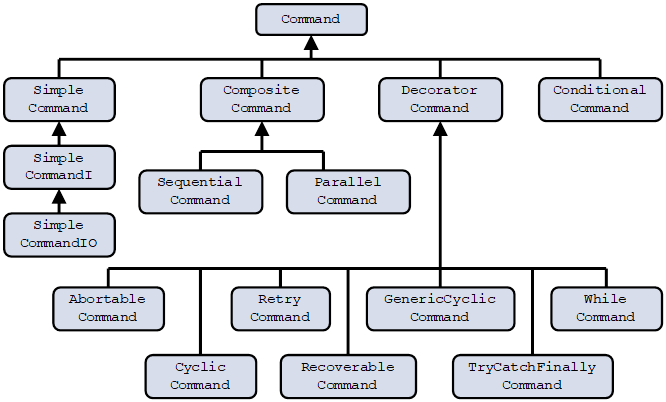

[](https://github.com/ichizhov/ExtensibleCommands/blob/main/LICENSE)
[](https://www.nuget.org/packages/ExtensibleCommands)
[](https://search.maven.org/artifact/io.github.ichizhov/extensiblecommands/1.0.0/jar)

# Extensible Commands

## 1. Introduction. Why Extensible Commands?

I am a software engineer creating software that controls complex machinery in modern high-tech factories. This project aims to solve several practical architectural and software engineering challenges I encountered in my work. After developing this project on and off for several years and successfully applying it to substantially enhance the quality, flexibility, and speed of development of my software I decided to publish it as an open-source project.

So, what are the challenges this project aspires to address?

When one creates software that controls a complex piece of equipment, one is very quickly faced with the need to develop and maintain sequences of operational steps, or workflows. These sequences quickly grow into a hierarchy of progressively complex operations that could be initiated individually or as part of yet more complex sequences. They constantly need to be modified, optimized, moved around, split, and merged, in response to project development needs. The original "pain point" that gave rise to this project was the extreme difficulty of keeping error-handling aspects of the code intact and correctly functioning during these modifications. However, the solution turned out to provide many more benefits than just resolving this original problem. Thus, the motivation behind this work is the desire to find a better way to deal with the high volatility of operational sequence code, and encapsulate many aspects of this volatility behind a dedicated infrastructural implementation.

Many software products are offering various levels of workflow (sometimes also referred to as Directed Acyclic Graphs, or DAGs) or orchestration automation. A representative list can be found [here](https://github.com/meirwah/awesome-workflow-engines). Almost all of these products are specific to a particular domain (such as business process automation) or written in languages rarely used in my domain of interest. Some require extensive dependencies on other libraries with licenses that may not be suitable for commercial development and deployment. As such, they are generally not well suited for dealing with the high volatility of operational sequence code in the equipment control software domain.

There are important aspects that set Extensible Commands apart from the majority of workflow automation solutions:
- Extensible Commands is geared towards near real-time execution, with very low-performance overhead;
- Extensible Commands does not support storing and retrieving workflows;
- Extensible Commands does not have any component responsible for executing workflows, workflows are responsible for executing themselves;
- Extensible Commands does not implement any graphic representation of workflows, the internal structure of workflows is represented by textual code;
- Extensible Commands is limited to abstract flow control functionality and does not attempt to implement domain-specific business logic.

Though my experience was specific to workflows in complex hardware systems, the principles and implementation of Extensible Commands contain no assumptions about the application domain. They use only the basic constructs of high-level programming languages (C# and Java). It should be possible to reuse it in any domain where the orchestration of complex sequences is a highly volatile area of the code. 

The area of applicability and limitations of Extensible Commands are discussed in more detail in [Section 2 of Main Documentation](Docs/Section2.md).

## 2. The basic structure of the project.

The body of the code contains 2 mirror implementations: in [C#](CSharp/ExtensibleCommands/ExtensibleCommands) and [Java](Java/ExtensibleCommands/src/main/java/org/extensiblecommands). Each contains the main project and the unit test project. Unit tests also serve as a reference for the practical use of the library code in different scenarios.

The main project contains classes implementing Extensible Commands. The approach is inspired by the command pattern as described by the ["Gang of Four"](https://springframework.guru/gang-of-four-design-patterns/). The essence of the approach is to combine the command pattern (with the encapsulation of the operation inside a class), and the composite pattern (with the combination of inheritance and composition relationship). This allows the construction of a hierarchy of command objects that are derived from each other and can be contained within each other.

The overall class diagram of the project is shown below.



Each command class implements an aspect of flow control functionality. Many correspond to functionality already implemented in high-level programming languages (such as ConditionalCommand for the if-else operator), but others represent control functionality not available "out of the box" (such as RetryCommand). SimpleCommand classes serve as the implementors of the actual content of operations, while all other commands serve to stitch these individual operations into coordinated sequences.

In a practical application, instances of these classes can be created and combined into sequences. Also, new classes can be derived from the standard command classes adding new functionalities to them.

Each command can be executed by calling its Run() method. There is no external execution manager. As the command is being executed, it goes through various states that can be monitored. 

This section is just a brief introduction to the internals of the Extensible Commands library. For a detailed description, please see the [Main Documentation](Docs/TableOfContent.md).

## 3. Getting started.

### 3.1. C#.

To add Extensible Commands dependency to a C#/.NET project, search for “ExtensibleCommands” in NuGet Package Manager, select, and install it. 

Detailed step-by-step instructions for creating a canonical "Hello World" application can be found [here](Docs/HelloWorldCSharp.md). 

### 3.2. Java.

To add Extensible Commands dependency to a Java project, add the following block to <dependencies> node in your pom.xml file: 
```
<dependency> 
    <groupId>io.github.ichizhov</groupId> 
    <artifactId>extensiblecommands</artifactId> 
    <version>1.1.0</version> 
</dependency> 
```

Detailed step-by-step instructions for creating a canonical "Hello World" application can be found [here](Docs/HelloWorldJava.md). 

### 3.3. Documentation and code samples.

Code samples used in the documentation to illustrate the basic use of command classes can be found in this unit test source file:  [CSharp/ExtensibleCommands/ExtensibleCommandsUnitTests/CommandExamplesTest.cs](CSharp/ExtensibleCommands/ExtensibleCommandsUnitTests/CommandExamplesTest.cs). They are in C# only, there is no corresponding file in the Java project.

Unit tests are organized by command classes and are a good source to get more insights into the details of each command class ([[C# unit tests]](CSharp/ExtensibleCommands/ExtensibleCommandsUnitTests)[[Java unit tests]](Java/ExtensibleCommands/src/test/java/org/extensiblecommands)). 

For practical use cases of complex command construction, please see [Section 5 of Main Documentation](Docs/Section5.md) and these unit test source files:  [CSharp/ExtensibleCommands/ExtensibleCommandsUnitTests/GenericExtensibleCommandsTest.cs](CSharp/ExtensibleCommands/ExtensibleCommandsUnitTests/GenericExtensibleCommandsTest.cs) (C#) and [Java/ExtensibleCommands/src/test/java/org/extensiblecommands/GenericExtensibleCommandsTest.java](Java/ExtensibleCommands/src/test/java/org/extensiblecommands/GenericExtensibleCommandsTest.java) (Java).

## 4. Difference between C# and Java implementations.

C# and Java implementations are written to be as similar as possible. C# generally adopts [Microsoft coding style](https://docs.microsoft.com/en-us/dotnet/csharp/programming-guide/inside-a-program/coding-conventions), and Java - [Google coding style](https://google.github.io/styleguide/javaguide.html). The substantive differences beyond generic coding style differences are documented in the table below.

|Item/Area|C#|Java|
|---------------|---------------|------------|
|Platform|.NET Standard 2.0|JDK 12.0|
|Dependencies|System.Reactive 5.0.0|io.reactivex.rxjava2:rxjava:2.1.0|
|Thread Synchronization	|Use standard class ManualResetEventSlim.|Since there is no standard class with the same functionality, a custom ManualResetEvent class is implemented using an instance of object class under the hood.|
|Delegates|Use language keyword delegate.	|Define interfaces with a single method with an appropriate signature. This generates extra interface source files that do not exist in the C# version of the code.|
|Properties|Use regular or auto properties, as needed. |Use get()/set() methods to access or modify the fields. |
|Exceptions|Throw exceptions of type Exception as needed.|Exceptions of type RuntimeException are thrown during command execution failures.|
|Comments|Use XML comments.|Use JavaDoc comments (for non-trivial methods and fields).|
|Order of declarations within a class|Properties -> Fields -> Constructors -> Public methods -> Private methods|Fields -> Constructors -> Public methods ->Private methods|

## 5. Links

Here are links to various parts of the Extensible Commands code and documentation:

[Main Documentation](Docs/TableOfContent.md)
    
[C# code](CSharp/ExtensibleCommands/ExtensibleCommands)
    
[C# unit tests](CSharp/ExtensibleCommands/ExtensibleCommandsUnitTests)
    
[Java code](Java/ExtensibleCommands/src/main/java/org/extensiblecommands)
    
[Java unit tests](Java/ExtensibleCommands/src/test/java/org/extensiblecommands)
